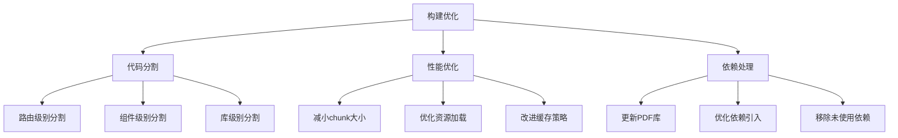

# 构建优化计划

根据构建分析结果，我们发现以下需要优化的问题：

1. 部分 chunks 超过 1000kB
2. PDF.js 使用 eval 的警告
3. 依赖加载效率问题

## 优化方案

## 详细实施计划

### 1. 代码分割优化

#### 路由级别分割
- 实现路由懒加载
- 配置预加载策略
- 优化加载提示

#### 组件级别分割
- Markdown 编辑器动态导入
- PDF 查看器按需加载
- 大型组件异步加载

#### 库级别分割
- 优化 vendor 分包策略
- 实现共享依赖复用
- CDN 加载非关键依赖

### 2. 性能优化

#### 减小 chunk 大小
- 设置合理的分割阈值
- 优化资源打包策略
- 移除冗余代码

#### 优化资源加载
- 实现资源预加载
- 配置缓存策略
- 优化加载顺序

#### 改进缓存策略
- 配置长期缓存
- 优化缓存更新
- 实现增量更新

### 3. 依赖处理

#### 更新 PDF 库
- 升级 pdfjs-dist
- 处理 eval 警告
- 优化加载方式

#### 优化依赖引入
- 按需导入组件
- 移除未使用导出
- Tree Shaking 优化

#### 移除未使用依赖
- 分析依赖关系
- 清理冗余依赖
- 优化包体积

## 预期效果

1. 初始加载速度提升
2. 资源加载优化
3. 构建警告解决
4. 缓存效率提升

## 后续计划

1. 性能监控
2. 加载分析
3. 持续优化

您觉得这个计划如何？需要调整或补充吗？