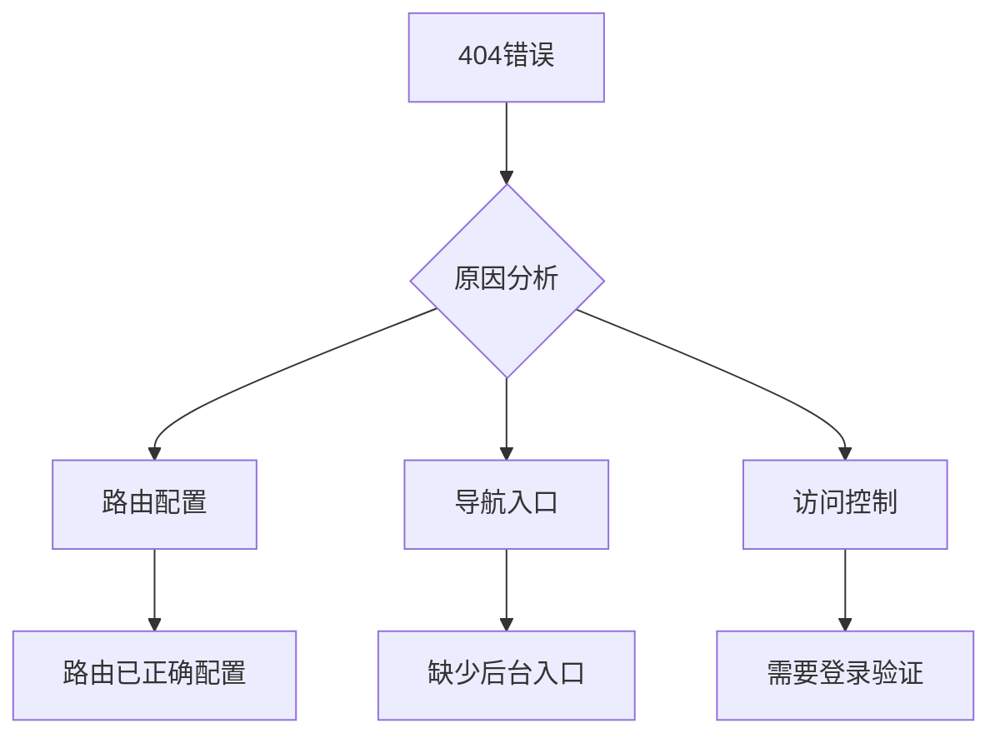

# Dashboard访问问题修复方案

## 问题描述

用户无法访问 `https://ngpox.cn/dashboard`，遇到404错误。主要涉及导航访问和路由配置问题。

## 问题分析



### 当前状态

1. 路由配置
- 后台相关路由已在 `App.tsx` 中正确配置
- 包含登录、注册和各个功能页面
- 使用 `PrivateRoute` 进行访问控制

2. 导航问题
- `Header.tsx` 中缺少后台入口
- 用户无法通过导航栏访问后台

3. 访问控制
- 后台路由需要用户登录
- 未登录用户会被重定向到登录页面

## 解决方案

### 1. 添加后台导航入口

在 `Header.tsx` 中的 navigation 数组添加后台入口：

```typescript
const navigation = [
  { name: '首页', href: '/' },
  { name: '文章', href: '/posts' },
  { name: '阿飞加练', href: '/practice' },
  { name: '采购助手', href: '/ai-assistant' },
  { name: '关于', href: '/about' },
  { name: '后台', href: '/dashboard', requireAuth: true }, // 新增后台入口
];
```

### 2. 根据登录状态显示导航

修改 Header 组件以根据用户登录状态显示后台入口：

```typescript
const Header = () => {
  const { user } = useAuthStore();
  
  // 过滤导航项
  const filteredNavigation = navigation.filter(item => 
    !item.requireAuth || (item.requireAuth && user)
  );
  
  // 在导航渲染中使用过滤后的导航项
  // ...
}
```

### 3. 优化访问流程

1. 直接访问处理
- 未登录用户访问 `/dashboard/*` 会重定向到登录页
- 登录页面将记录原始请求URL
- 登录成功后自动跳转回原始页面

2. 路由权限控制
```typescript
// PrivateRoute组件已实现以下功能：
- 检查用户登录状态
- 未登录时重定向到登录页
- 保存当前访问路径用于登录后跳转
```

## 实施步骤

1. 修改 Header 组件
- 添加后台导航配置
- 实现基于登录状态的导航显示
- 添加合适的样式

2. 测试路由访问
- 验证未登录访问的重定向
- 测试登录后的自动跳转
- 确认所有后台路由都正确受保护

3. 部署更新
- 推送代码更改
- 验证生产环境的修复效果

## 注意事项

1. 确保登录状态正确维护
2. 注意路由权限的一致性
3. 提供清晰的用户反馈
4. 保持导航体验的流畅性