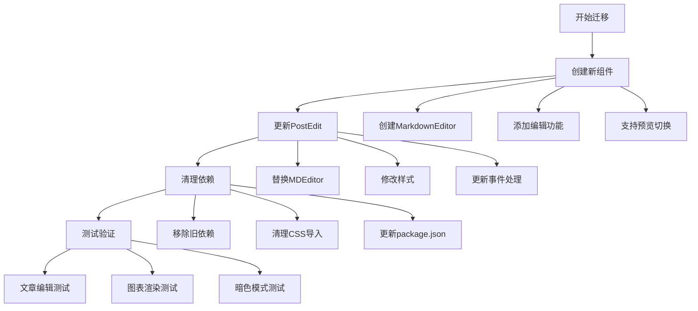

# Markdown编辑器迁移计划

## 当前问题

1. PostEdit组件仍在使用@uiw/react-md-editor
2. index.css导入了不存在的markdown-editor.css
3. 可能存在其他组件仍在使用旧的编辑器

## 迁移步骤



### 1. 创建新组件

#### 1.1 创建MarkdownEditor组件
- 基于MarkdownWithMermaid组件
- 添加编辑功能
- 支持实时预览
- 保持现有的主题支持

#### 1.2 组件结构
```typescript
interface MarkdownEditorProps {
  value: string;
  onChange: (value: string) => void;
  height?: number;
  preview?: boolean;
}
```

### 2. 更新PostEdit组件

#### 2.1 依赖替换
```diff
- import MDEditor from '@uiw/react-md-editor';
+ import MarkdownEditor from '../../components/markdown/MarkdownEditor';
```

#### 2.2 组件使用更新
```tsx
<MarkdownEditor
  value={formData.content}
  onChange={handleContentChange}
  height={500}
/>
```

### 3. 清理工作

#### 3.1 删除旧依赖
```bash
npm uninstall @uiw/react-md-editor
```

#### 3.2 更新样式导入
```diff
- import '@uiw/react-md-editor/markdown-editor.css';
+ import './styles/markdown.css';
```

### 4. 测试验证

#### 4.1 测试场景
1. 文章编辑基本功能
2. Markdown语法高亮
3. 实时预览功能
4. Mermaid图表支持
5. 暗色模式适配

#### 4.2 回归测试
- 编辑现有文章
- 创建新文章
- 预览渲染效果
- 检查主题切换

## 风险评估

1. 功能兼容性风险
- 可能有特殊的markdown语法需要支持
- 编辑器快捷键可能需要重新实现

2. 用户体验风险
- 编辑体验可能与原来不同
- 可能需要添加新的使用说明

3. 性能风险
- 需要确保大文档的编辑性能
- 实时预览可能需要性能优化

## 后续优化

1. 编辑器增强
- 添加工具栏
- 支持文件上传
- 添加更多快捷键

2. 预览优化
- 支持滚动同步
- 添加目录导航
- 优化图表渲染性能

## 时间估计

1. 组件开发: 2小时
2. 迁移工作: 1小时
3. 测试修复: 1小时
4. 总计: 4小时

请确认这个计划是否合适，我们可以开始实施迁移工作。