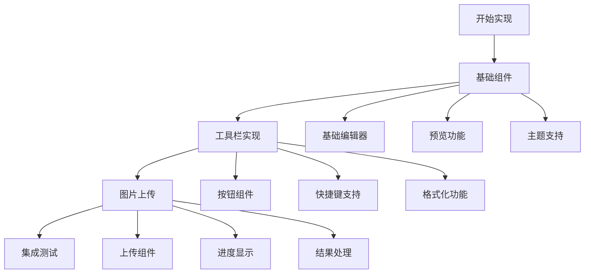

# Markdown编辑器迁移计划 V2

## 功能需求更新

1. 基础功能
- Markdown渲染
- Mermaid图表支持
- 暗色模式适配

2. 工具栏功能
- 文本格式化（加粗、斜体、删除线）
- 标题（H1-H6）
- 列表（有序、无序）
- 链接和图片
- 代码块和引用
- Mermaid图表插入

3. 图片上传功能
- 本地图片上传
- 图片预览
- 进度显示
- 错误处理

## 实现步骤



### 1. 创建基础组件

#### 1.1 MarkdownEditor组件
```typescript
interface MarkdownEditorProps {
  value: string;
  onChange: (value: string) => void;
  onImageUpload?: (file: File) => Promise<string>;
  height?: number;
  className?: string;
}
```

#### 1.2 EditorToolbar组件
```typescript
interface ToolbarProps {
  onAction: (action: ToolbarAction, value?: string) => void;
  className?: string;
}

type ToolbarAction =
  | 'bold'
  | 'italic'
  | 'strike'
  | 'h1'
  | 'h2'
  | 'h3'
  | 'list'
  | 'ordered-list'
  | 'link'
  | 'image'
  | 'code'
  | 'quote'
  | 'mermaid';
```

#### 1.3 ImageUploader组件
```typescript
interface ImageUploaderProps {
  onUpload: (file: File) => Promise<string>;
  onProgress?: (percent: number) => void;
  onError?: (error: Error) => void;
}
```

### 2. 组件实现顺序

1. 先实现基础编辑器
```typescript
const MarkdownEditor = ({ value, onChange }: MarkdownEditorProps) => {
  return (
    <div className="markdown-editor">
      <textarea
        value={value}
        onChange={(e) => onChange(e.target.value)}
        className="editor-input"
      />
      <div className="preview">
        <MarkdownPreview content={value} />
      </div>
    </div>
  );
};
```

2. 添加工具栏
```typescript
const EditorToolbar = ({ onAction }: ToolbarProps) => {
  return (
    <div className="toolbar">
      <button onClick={() => onAction('bold')}>
        <Bold size={16} />
      </button>
      {/* 其他工具栏按钮 */}
    </div>
  );
};
```

3. 实现图片上传
```typescript
const ImageUploader = ({ onUpload, onProgress }: ImageUploaderProps) => {
  const handleFileChange = async (e: React.ChangeEvent<HTMLInputElement>) => {
    const file = e.target.files?.[0];
    if (file) {
      try {
        const url = await onUpload(file);
        // 插入图片链接到编辑器
      } catch (error) {
        console.error('Upload failed:', error);
      }
    }
  };
  
  return (
    <input
      type="file"
      accept="image/*"
      onChange={handleFileChange}
    />
  );
};
```

### 3. 样式设计

```css
.markdown-editor {
  @apply flex flex-col border rounded-lg overflow-hidden;
}

.editor-toolbar {
  @apply flex items-center gap-1 p-2 border-b bg-gray-50 dark:bg-gray-800;
}

.editor-content {
  @apply flex flex-1 min-h-[300px];
}

.editor-input {
  @apply w-1/2 p-4 resize-none focus:outline-none border-r;
}

.editor-preview {
  @apply w-1/2 p-4 overflow-auto;
}
```

### 4. 集成到PostEdit

```tsx
<MarkdownEditor
  value={formData.content}
  onChange={handleContentChange}
  onImageUpload={handleImageUpload}
  className="min-h-[500px]"
/>
```

### 5. 测试计划

1. 基础功能测试
- 编辑器基本输入
- Markdown预览
- 主题切换

2. 工具栏测试
- 所有格式化按钮
- 快捷键支持
- 工具栏响应式

3. 图片上传测试
- 文件选择
- 上传进度
- 错误处理
- 图片预览

4. 集成测试
- PostEdit组件集成
- 文章保存
- 性能测试

## 时间估计

1. 基础编辑器：4小时
2. 工具栏实现：4小时
3. 图片上传：2小时
4. 集成测试：2小时
5. 总计：12小时

确认这个更新后的计划是否符合您的需求？我们可以开始实施第一步：创建基础的MarkdownEditor组件。