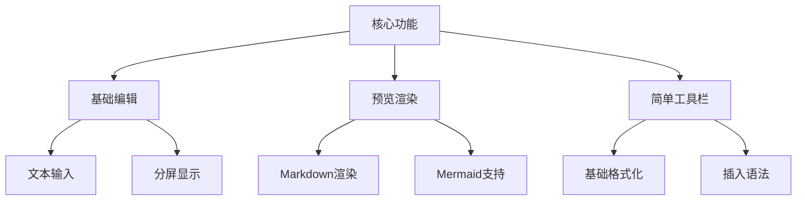

# Markdown编辑器迁移计划 V3

## 简化需求



### 1. 核心功能

1. 基础编辑
   - 文本输入区域
   - 实时预览
   - 分屏显示

2. 简单工具栏
   - 标题（H1-H3）
   - 加粗
   - 列表
   - 代码块
   - Mermaid图表

3. 预览功能
   - Markdown渲染
   - Mermaid图表支持
   - 暗色模式适配

### 2. 组件实现

#### 2.1 工具栏按钮组件
```typescript
interface ToolbarButtonProps {
  icon: React.ReactNode;
  onClick: () => void;
  title: string;
}

const ToolbarButton = ({ icon, onClick, title }: ToolbarButtonProps) => (
  <button
    onClick={onClick}
    className="p-2 hover:bg-gray-100 dark:hover:bg-gray-700 rounded"
    title={title}
  >
    {icon}
  </button>
);
```

#### 2.2 编辑器组件
```typescript
interface MarkdownEditorProps {
  value: string;
  onChange: (value: string) => void;
  height?: number;
  className?: string;
}

const MarkdownEditor = ({ value, onChange, height = 500 }: MarkdownEditorProps) => {
  const insertText = (prefix: string, suffix: string = '') => {
    // 在光标位置插入文本
  };

  return (
    <div className="markdown-editor">
      <div className="toolbar">
        <ToolbarButton icon={<Heading1 />} onClick={() => insertText('# ')} />
        {/* 其他工具栏按钮 */}
      </div>
      <div className="editor-content">
        <textarea value={value} onChange={(e) => onChange(e.target.value)} />
        <div className="preview">
          <MarkdownPreview content={value} />
        </div>
      </div>
    </div>
  );
};
```

### 3. 样式设计

```css
.markdown-editor {
  @apply flex flex-col border rounded-lg;
}

.toolbar {
  @apply flex items-center gap-1 p-2 border-b;
}

.editor-content {
  @apply grid grid-cols-2;
}

.preview {
  @apply border-l p-4 overflow-auto;
}
```

### 4. 实施步骤

1. 基础组件（2小时）
   - 创建编辑器布局
   - 实现输入和预览
   - 添加基本样式

2. 工具栏（1小时）
   - 创建工具栏组件
   - 实现基础按钮
   - 添加文本插入功能

3. 迁移集成（1小时）
   - 替换PostEdit中的编辑器
   - 更新样式和主题
   - 删除旧依赖

4. 测试（1小时）
   - 基础编辑功能
   - Markdown渲染
   - Mermaid图表支持

总计：5小时

### 5. 后续优化

- 添加图片上传功能
- 支持快捷键
- 优化工具栏布局
- 添加更多编辑功能

这个简化后的计划专注于最核心的功能，可以快速实现基本的编辑体验。确认这个计划是否可以开始实施？