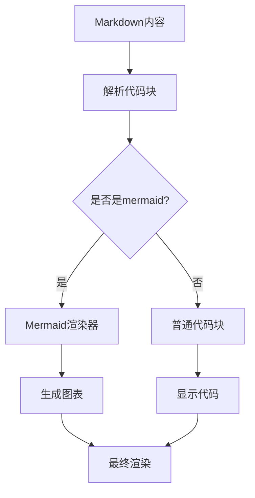
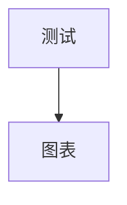

# Mermaid 图表渲染问题修复方案 V2

## 问题分析

1. 当前状态：
- 使用 `MDEditor.Markdown` 渲染文章内容
- mermaid代码块被显示为纯文本
- 没有进行图表渲染

2. 需求：
- 正确识别mermaid代码块
- 将代码块渲染为对应的图表
- 保持其他Markdown内容的正常渲染

## 解决方案

### 实现专用的Markdown渲染组件



1. 创建新的Markdown渲染组件：
```typescript
const MarkdownWithMermaid = ({ content }: { content: string }) => {
  return (
    <ReactMarkdown
      remarkPlugins={[remarkGfm]}
      components={{
        code({ node, inline, className, children, ...props }) {
          if (className === 'language-mermaid') {
            return <MermaidRenderer content={String(children)} />;
          }
          return <code className={className} {...props}>{children}</code>;
        }
      }}
    >
      {content}
    </ReactMarkdown>
  );
};
```

2. 优化MermaidRenderer组件：
```typescript
const MermaidRenderer = ({ content }: { content: string }) => {
  const elementRef = useRef<HTMLDivElement>(null);
  
  useEffect(() => {
    if (elementRef.current) {
      // 清空容器
      elementRef.current.innerHTML = '';
      // 生成唯一ID
      const id = `mermaid-${Math.random().toString(36).substr(2, 9)}`;
      elementRef.current.id = id;
      
      // 使用mermaid渲染
      mermaid.render(id, content).then(({ svg }) => {
        if (elementRef.current) {
          elementRef.current.innerHTML = svg;
        }
      });
    }
  }, [content]);

  return <div ref={elementRef} className="mermaid my-4" />;
};
```

3. 更新组件使用：
```typescript
// PostView.tsx
<div className="prose prose-lg dark:prose-invert max-w-none">
  <MarkdownWithMermaid content={currentViewPost.content} />
</div>
```

## 实施步骤

1. 添加依赖：
```bash
npm uninstall @uiw/react-md-editor
npm install mermaid react-markdown remark-gfm
```

2. 创建组件文件：
- src/components/markdown/MarkdownWithMermaid.tsx
- src/components/markdown/MermaidRenderer.tsx

3. 配置mermaid：
```typescript
mermaid.initialize({
  startOnLoad: false,
  theme: 'default',
  securityLevel: 'loose',
  fontSize: 16
});
```

4. 替换现有Markdown渲染：
- 替换PostView中的MDEditor.Markdown
- 更新其他使用Markdown渲染的地方

5. 样式调整：
```css
.mermaid {
  background: transparent !important;
}
.mermaid svg {
  max-width: 100%;
  height: auto;
}
```

## 预期效果

1. mermaid代码块将被正确识别
2. 图表将被渲染为SVG
3. 支持所有mermaid图表类型：
   - flowchart
   - sequence diagram
   - mindmap
   - 等

## 验证方法

1. 测试不同类型的图表：



2. 检查渲染效果：
- 图表是否正确显示
- 样式是否合适
- 暗色模式支持

是否需要我进一步完善某个部分？或者我们可以开始实现这个方案了。