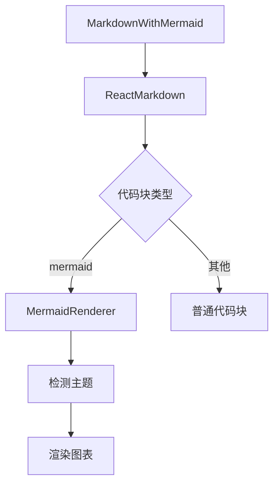

# Mermaid 图表渲染问题修复方案 V3

## 需求更新

1. 基本需求：
- 正确渲染mermaid图表
- 替换现有的MDEditor.Markdown实现

2. 主题支持：
- 支持亮色模式
- 支持暗色模式
- 主题切换时实时更新

## 技术方案

### 1. 组件结构设计



### 2. 主题感知实现

```typescript
// 创建主题Context
const MermaidThemeContext = createContext({
  isDark: false,
  updateTheme: (isDark: boolean) => {}
});

// Mermaid配置生成器
const getMermaidConfig = (isDark: boolean) => ({
  startOnLoad: false,
  theme: isDark ? 'dark' : 'default',
  themeVariables: isDark ? {
    background: '#1e293b', // gray-800
    primaryColor: '#3b82f6',
    primaryTextColor: '#e2e8f0',
    secondaryColor: '#475569',
    lineColor: '#94a3b8'
  } : {
    background: '#ffffff',
    primaryColor: '#3b82f6',
    primaryTextColor: '#1e293b',
    secondaryColor: '#e2e8f0',
    lineColor: '#64748b'
  }
});
```

### 3. 组件实现

1. MermaidRenderer组件：
```typescript
const MermaidRenderer = ({ content }: { content: string }) => {
  const containerRef = useRef<HTMLDivElement>(null);
  const { isDark } = useContext(MermaidThemeContext);
  
  useEffect(() => {
    if (containerRef.current) {
      const id = `mermaid-${Math.random().toString(36).substr(2, 9)}`;
      containerRef.current.innerHTML = '';
      containerRef.current.id = id;
      
      // 配置mermaid
      mermaid.initialize(getMermaidConfig(isDark));
      
      // 渲染图表
      mermaid.render(id, content).then(({ svg }) => {
        if (containerRef.current) {
          containerRef.current.innerHTML = svg;
        }
      }).catch(error => {
        console.error('Mermaid rendering failed:', error);
        if (containerRef.current) {
          containerRef.current.innerHTML = `
            <div class="text-red-500 dark:text-red-400">
              图表渲染失败：${error.message}
            </div>
          `;
        }
      });
    }
  }, [content, isDark]); // 当主题改变时重新渲染

  return (
    <div 
      ref={containerRef} 
      className="mermaid my-4 p-4 rounded-lg bg-white dark:bg-gray-800"
    />
  );
};
```

2. MarkdownWithMermaid组件：
```typescript
const MarkdownWithMermaid = ({ content }: { content: string }) => {
  const { isDark } = useThemeStore(); // 使用主题状态管理

  return (
    <MermaidThemeContext.Provider value={{ isDark }}>
      <ReactMarkdown
        remarkPlugins={[remarkGfm]}
        components={{
          code({ node, inline, className, children, ...props }) {
            if (className === 'language-mermaid') {
              return <MermaidRenderer content={String(children)} />;
            }
            return <code className={className} {...props}>{children}</code>;
          }
        }}
      >
        {content}
      </ReactMarkdown>
    </MermaidThemeContext.Provider>
  );
};
```

### 4. 样式配置

```css
/* 图表容器样式 */
.mermaid {
  transition: background-color 0.3s ease;
}

/* 暗色模式下的SVG样式调整 */
.dark .mermaid svg {
  filter: brightness(0.9);
}

/* 确保图表自适应容器宽度 */
.mermaid svg {
  max-width: 100%;
  height: auto;
}
```

## 实施步骤

1. 依赖调整：
```bash
npm uninstall @uiw/react-md-editor
npm install mermaid react-markdown remark-gfm
```

2. 创建新文件：
- src/components/markdown/MermaidThemeContext.ts
- src/components/markdown/MermaidRenderer.tsx
- src/components/markdown/MarkdownWithMermaid.tsx

3. 更新现有组件：
- 修改 PostView.tsx 使用新的 MarkdownWithMermaid
- 更新其他使用 Markdown 渲染的地方

4. 添加测试用例：
```markdown
亮色模式图表：
\`\`\`mermaid
graph TB
    A[开始] --> B{判断}
    B -- 是 --> C[处理]
    B -- 否 --> D[结束]
\`\`\`

暗色模式图表：
\`\`\`mermaid
mindmap
  root((主题))
    亮色
      白色背景
      深色文字
    暗色
      深色背景
      浅色文字
\`\`\`
```

## 预期效果

1. 图表渲染：
- 正确显示各类图表
- 图表样式与整体主题协调
- 支持自适应宽度

2. 主题切换：
- 切换主题时图表自动更新
- 保持良好的可读性
- 平滑的过渡效果

3. 错误处理：
- 显示友好的错误提示
- 保持页面稳定性

请确认这个方案是否满足需求，我们可以开始实现了。