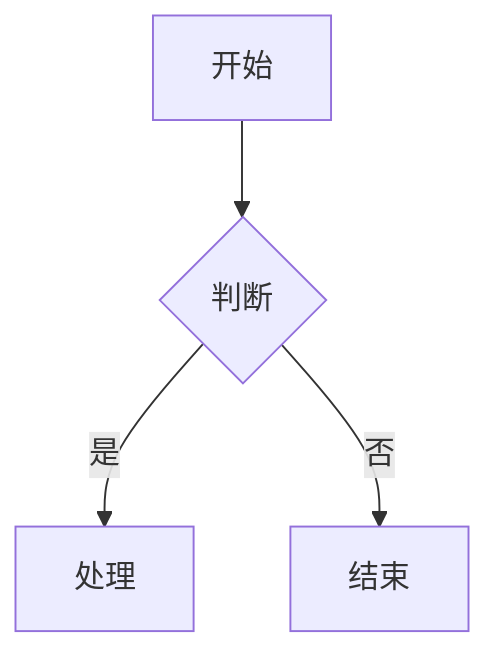
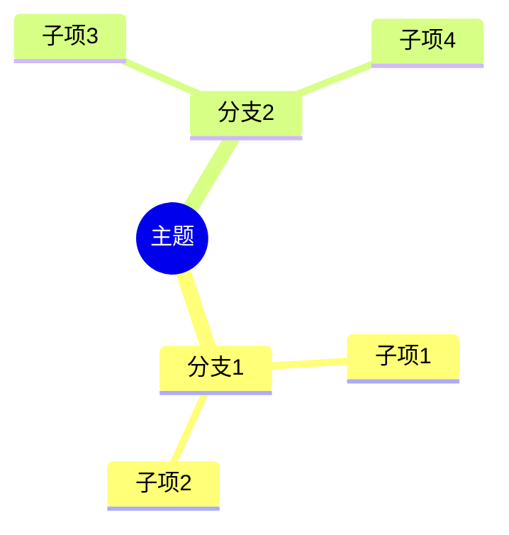
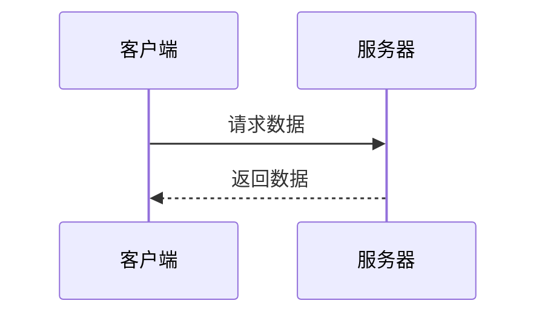
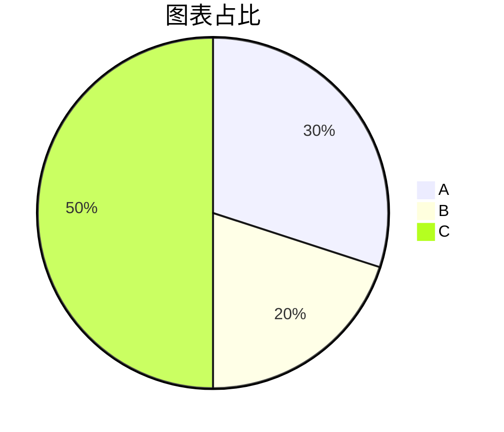
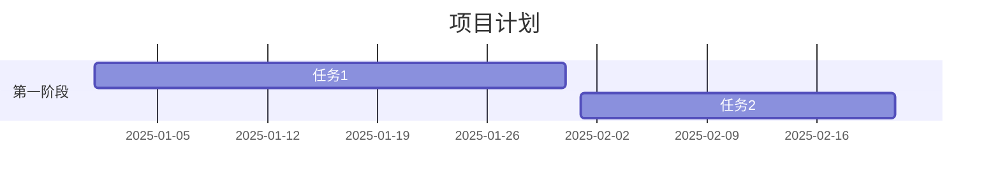

# Mermaid图表测试

## 流程图测试

## 思维导图测试

## 时序图测试

## 饼图测试

## 甘特图测试

如果以上所有图表都能正确渲染，说明mermaid的集成是成功的。每种图表都应该：

1. 在亮色模式下正常显示
2. 在暗色模式下保持良好的可见性
3. 支持自适应宽度
4. 保持文字清晰可读

## 测试要点

1. 图表渲染
- [ ] 所有图表类型都能正确显示
- [ ] 没有渲染错误或警告
- [ ] 图表大小适中，不会过大或过小

2. 暗色模式
- [ ] 切换到暗色模式时图表颜色自动调整
- [ ] 文字保持清晰可读
- [ ] 图表边框和连线清晰可见

3. 响应式设计
- [ ] 在不同屏幕宽度下图表能自适应调整
- [ ] 图表不会溢出容器
- [ ] 文字不会重叠或截断

4. 交互体验
- [ ] 图表加载平滑，没有闪烁
- [ ] 主题切换时过渡自然
- [ ] 缩放行为正常