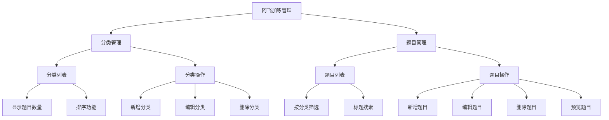

# 阿飞加练管理功能实现方案

## 数据库结构

### 表结构
1. categories表
```sql
| 列名        | 类型                     | 默认值                                  | 可空  |
|------------|--------------------------|----------------------------------------|-------|
| id         | integer                 | nextval('categories_id_seq'::regclass) | NO    |
| name       | character varying       | null                                   | NO    |
| order_index| integer                 | 0                                      | YES   |
| created_at | timestamp with time zone| timezone('utc'::text, now())          | YES   |
```

2. questions表
```sql
| 列名        | 类型                     | 默认值                                  | 可空  |
|------------|--------------------------|----------------------------------------|-------|
| id         | uuid                    | uuid_generate_v4()                     | NO    |
| category_id| integer                 | null                                   | NO    |
| title      | text                    | null                                   | NO    |
| content    | text                    | null                                   | NO    |
| answer     | text                    | null                                   | NO    |
| explanation| text                    | null                                   | YES   |
| created_at | timestamp with time zone| timezone('utc'::text, now())          | YES   |
```

### 表关系
- questions表通过`category_id`外键关联到`categories`表的`id`列

### 权限策略
已添加以下权限：
```sql
-- 分类表权限
CREATE POLICY "Enable admin categories CRUD" ON public.categories
FOR ALL
TO authenticated
USING (auth.role() = 'authenticated')
WITH CHECK (auth.role() = 'authenticated');

-- 题目表权限
CREATE POLICY "Enable admin questions CRUD" ON public.questions
FOR ALL
TO authenticated
USING (auth.role() = 'authenticated')
WITH CHECK (auth.role() = 'authenticated');
```

### 辅助函数
```sql
-- 获取分类下的题目数量
CREATE OR REPLACE FUNCTION get_category_questions_count(p_category_id integer)
RETURNS integer
LANGUAGE plpgsql
SECURITY DEFINER
AS $$
BEGIN
    RETURN (
        SELECT COUNT(*)
        FROM public.questions
        WHERE category_id = p_category_id
    );
END;
$$;

-- 更新分类顺序
CREATE OR REPLACE FUNCTION update_category_order(p_category_id integer, p_new_order integer)
RETURNS void
LANGUAGE plpgsql
SECURITY DEFINER
AS $$
BEGIN
    UPDATE public.categories
    SET order_index = p_new_order
    WHERE id = p_category_id;
END;
$$;

-- 获取分类及其题目数量
CREATE OR REPLACE FUNCTION get_categories_with_count()
RETURNS TABLE (
    id integer,
    name varchar,
    order_index integer,
    questions_count bigint
)
LANGUAGE plpgsql
SECURITY DEFINER
AS $$
BEGIN
    RETURN QUERY
    SELECT 
        c.id,
        c.name,
        c.order_index,
        COUNT(q.id)::bigint as questions_count
    FROM categories c
    LEFT JOIN questions q ON c.id = q.category_id
    GROUP BY c.id, c.name, c.order_index
    ORDER BY c.order_index;
END;
$$;
```

## 前端实现方案

### 1. TypeScript 类型定义
```typescript
// src/types/practice.ts
interface Category {
  id: number;
  name: string;
  order_index: number;
  questions_count?: number;
}

interface Question {
  id: string; // UUID
  category_id: number;
  title: string;
  content: string;
  answer: string;
  explanation?: string;
  created_at: string;
}
```

### 2. 组件结构


### 3. 路由配置
```typescript
// src/App.tsx 中添加
<Route path="/dashboard/practice">
  <Route index element={<PracticeManagement />} />
  <Route path="questions/new" element={<QuestionForm />} />
  <Route path="questions/:id" element={<QuestionForm />} />
</Route>
```

### 4. 状态管理
```typescript
// src/store/practiceManagementStore.ts
interface PracticeManagementState {
  // 分类管理
  categories: Category[];
  loadingCategories: boolean;
  fetchCategories: () => Promise<void>;
  createCategory: (name: string) => Promise<void>;
  updateCategory: (id: number, data: Partial<Category>) => Promise<void>;
  deleteCategory: (id: number) => Promise<void>;
  updateCategoryOrder: (id: number, newOrder: number) => Promise<void>;
  
  // 题目管理
  questions: Question[];
  currentQuestion: Question | null;
  loadingQuestions: boolean;
  fetchQuestions: (categoryId?: number) => Promise<void>;
  createQuestion: (data: Omit<Question, 'id' | 'created_at'>) => Promise<void>;
  updateQuestion: (id: string, data: Partial<Question>) => Promise<void>;
  deleteQuestion: (id: string) => Promise<void>;
}
```

### 5. 实现步骤

1. 添加后台导航入口
```typescript
// src/components/dashboard/DashboardLayout.tsx
const navigation = [
  { name: '首页', href: '/dashboard' },
  { name: '文章管理', href: '/dashboard/posts' },
  { name: '阿飞加练管理', href: '/dashboard/practice' },
  { name: '用户管理', href: '/dashboard/users' },
  { name: '设置', href: '/dashboard/settings' }
];
```

2. 创建管理页面组件
- PracticeManagement.tsx：主页面组件
- CategorySection.tsx：分类管理区域
- QuestionSection.tsx：题目管理区域
- QuestionForm.tsx：题目编辑表单

3. 实现状态管理
```typescript
// src/store/practiceManagementStore.ts
export const usePracticeManagementStore = create<PracticeManagementState>((set, get) => ({
  // ... 状态实现
}));
```

4. 实现API调用
```typescript
// 分类管理
const createCategory = async (name: string) => {
  const { data, error } = await supabase
    .from('categories')
    .insert([{ name, order_index: 0 }])
    .select()
    .single();
  
  if (error) throw error;
  return data;
};

// 题目管理
const fetchQuestions = async (categoryId?: number) => {
  let query = supabase
    .from('questions')
    .select('*')
    .order('created_at', { ascending: false });
    
  if (categoryId) {
    query = query.eq('category_id', categoryId);
  }
  
  const { data, error } = await query;
  if (error) throw error;
  return data;
};
```

### 6. UI实现

1. 分类管理界面
```tsx
// src/components/practice/CategorySection.tsx
<div className="grid grid-cols-1 md:grid-cols-2 gap-6">
  {/* 左侧：分类列表 */}
  <div className="bg-white dark:bg-gray-800 rounded-lg p-6">
    <div className="flex justify-between items-center mb-4">
      <h2 className="text-lg font-semibold">分类管理</h2>
      <button onClick={openNewCategoryForm}>新增分类</button>
    </div>
    <CategoryList
      categories={categories}
      onEdit={handleEdit}
      onDelete={handleDelete}
      onOrderChange={handleOrderChange}
    />
  </div>
</div>
```

2. 题目编辑表单
```tsx
// src/components/practice/QuestionForm.tsx
<form onSubmit={handleSubmit}>
  <div className="space-y-6">
    {/* 分类选择 */}
    <div>
      <label>分类</label>
      <select value={categoryId} onChange={handleCategoryChange}>
        {categories.map(cat => (
          <option key={cat.id} value={cat.id}>{cat.name}</option>
        ))}
      </select>
    </div>
    
    {/* 题目标题 */}
    <div>
      <label>标题</label>
      <input type="text" value={title} onChange={handleTitleChange} />
    </div>
    
    {/* 题目内容（Markdown编辑器） */}
    <div>
      <label>内容</label>
      <MarkdownEditor value={content} onChange={handleContentChange} />
    </div>
    
    {/* 答案和解释 */}
    <div className="grid grid-cols-2 gap-6">
      <div>
        <label>答案</label>
        <input type="text" value={answer} onChange={handleAnswerChange} />
      </div>
      <div>
        <label>解释</label>
        <textarea value={explanation} onChange={handleExplanationChange} />
      </div>
    </div>
  </div>
</form>
```

### 7. 开发注意事项

1. 权限控制
- 确保用户已登录
- 验证用户是否有管理权限
- 使用适当的错误处理

2. 数据验证
- 分类名称不能为空
- 题目必须包含标题、内容和答案
- 验证题目格式的正确性

3. 用户体验
- 添加适当的加载状态
- 提供清晰的错误提示
- 实现预览功能
- 自动保存草稿

4. 性能优化
- 实现分页加载
- 添加适当的缓存
- 优化大量数据的渲染

完成这些实现后，就可以切换到Code模式开始具体的代码实现工作。