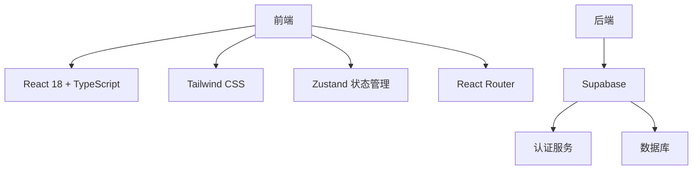

这是一个使用现代技术栈构建的综合性个人网站项目，主要包含以下部分：

1. 核心功能模块：
- 博客系统：支持Markdown文章编写、分类管理和阅读进度追踪
- 知识库系统：用于个人知识管理和分享
- AI助手：集成智能对话功能
- 练习系统：提供学习和实践平台
- 个人档案：展示个人信息、专利、项目等成就

2. 技术架构：

3. 项目特点：
- 完全响应式设计
- 支持暗黑模式
- 现代化UI和流畅动画
- Markdown支持
- 清晰的模块化结构

这个项目采用了现代Web开发最佳实践，包括类型安全、组件化开发、响应式设计等，并通过Supabase提供可靠的后端服务支持。